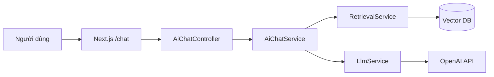
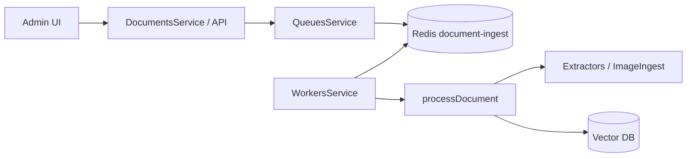

# Bản đồ tác nhân (agent map)

Tài liệu này giúp **người** và **trợ lý mã (Cursor, v.v.)** định vị nhanh *ai làm gì* trong repo RAG tutorial: từ luồng chat RAG đến hàng đợi xử lý tài liệu và chỗ cấu hình cho AI chỉnh sửa frontend.

---

## 1. Tác nhân trong ứng dụng (logic / runtime)

| Tác nhân | Vai trò ngắn | File / module chính |
|----------|--------------|---------------------|
| **Người dùng chat** | Gửi câu hỏi, nhận câu trả lời (có trích dẫn ngữ cảnh khi có RAG) | `fe/app/chat/page.tsx` → API backend |
| **Quản trị** | Upload, quét web, nguồn tri thức ngoài, xóa tài liệu | `fe/app/admin/**` |
| **AiChat** | Xác thực user, URL-only ingest tùy chọn, gọi retrieval + LLM, lưu hội thoại | `be/src/ai-chat/ai-chat.service.ts`, `be/src/ai-chat/ai-chat.controller.ts` |
| **Retrieval** | Embedding câu hỏi, tìm top-K chunk (pgvector hoặc Qdrant), hybrid/rerank theo cấu hình | `be/src/vector/retrieval/retrieval.service.ts` |
| **LLM** | Gọi OpenAI (trả lời có ngữ cảnh / câu trả lời chung), dùng chung cho pipeline khác | `be/src/llm/llm.service.ts` |
| **Documents** | Trích text (Tika/HTML), ảnh (OCR/Vision pipeline), chunk, embed, ghi vector | `be/src/documents/documents.service.ts`, `be/src/documents/extractors/**`, `be/src/documents/image-ingest.service.ts` |
| **Queue (BullMQ)** | Đẩy job ingest theo `documentId` | `be/src/queues/queues.service.ts` — hàng `document-ingest`, job `process-document` |
| **Worker** | Tiêu thụ hàng đợi, gọi `processDocument` | `be/src/workers/workers.service.ts` |
| **Vector store** | Lưu / tìm vector | `be/src/pgvector/**`, `be/src/qdrant.service.ts`, chọn qua `VECTOR_STORE` |
| **Knowledge source** | Cấu hình DB ngoài làm nguồn nội dung (Prisma model `KnowledgeSourceConfig`) | `be/src/knowledge-source/**` |
| **Auth** | JWT, throttle chat AI | `be/src/auth/**`, `be/src/auth/user-jwt-throttler.guard.ts` |

### Luồng hỏi–đáp (RAG)

### Luồng đưa tài liệu vào hệ thống

---

## 2. Tác nhân cho trợ lý chỉnh sửa mã (Cursor / Claude Code)

| Mục | Đường dẫn | Ghi chú |
|-----|-----------|---------|
| Quy tắc Next.js (phiên bản trong repo) | `fe/AGENTS.md` | Được `fe/CLAUDE.md` tham chiếu (`@AGENTS.md`) |
| Hướng dẫn dự án (tiếng Việt dễ đọc) | `docs/PROJECT_GUIDE_VI.md` | Kiến trúc, bước AI, API, lỗi thường gặp |
| Hướng dẫn dự án (tiếng Hàn) | `docs/PROJECT_GUIDE_KO.md` | Bản tương đương |
| Chạy nhanh monorepo | `README.md` | `fe` cổng 3003, `be` cổng 3080 |
| Biến môi trường backend | `be/.env.example` | Model, RAG, OCR, Redis, v.v. |
| Biến môi trường frontend | `fe/.env.example` | `NEXT_PUBLIC_API_BASE_URL` |

Khi sửa **UI chat hoặc admin**, bắt đầu từ `fe/app/`. Khi sửa **logic RAG hoặc ingest**, bắt đầu từ `be/src/ai-chat/`, `be/src/vector/`, `be/src/documents/`, `be/src/workers/`.

---

## 3. Module Nest gốc (`be/src/app.module.ts`)

Các mô-đun đã gắn vào ứng dụng (thứ tự liên quan tác nhân): `Documents`, `Uploads`, `Vector`, `Queues`, `Workers`, `Shared`, `Llm`, `AiChat`, `Auth`, `KnowledgeSource`.

---

*Tệp này là bản đồ tham chiếu; chi tiết hành vi nên đọc trực tiếp service tương ứng hoặc `docs/PROJECT_GUIDE_VI.md`.*
